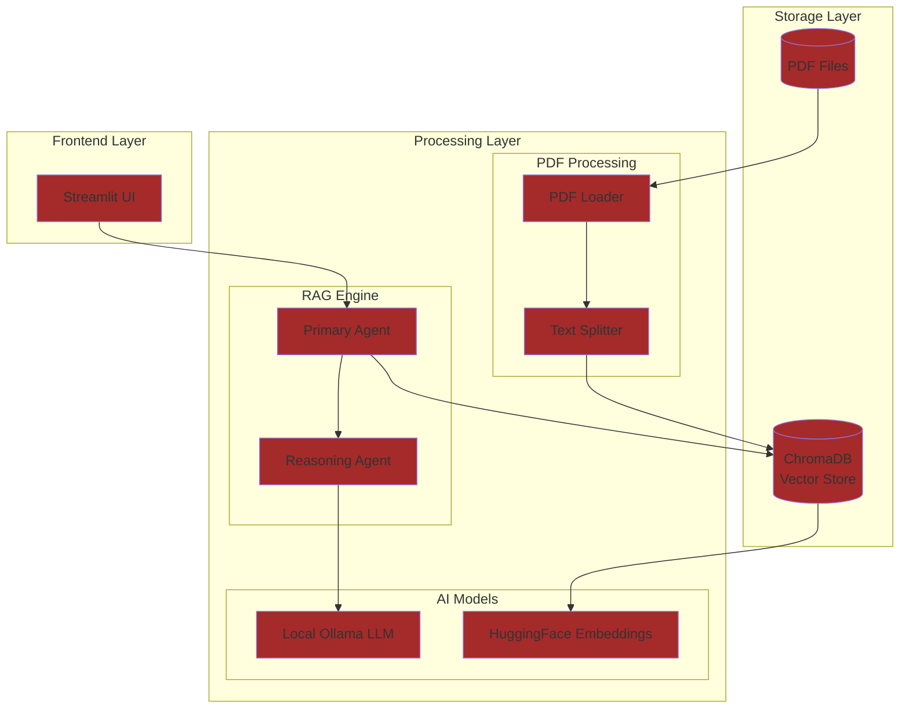
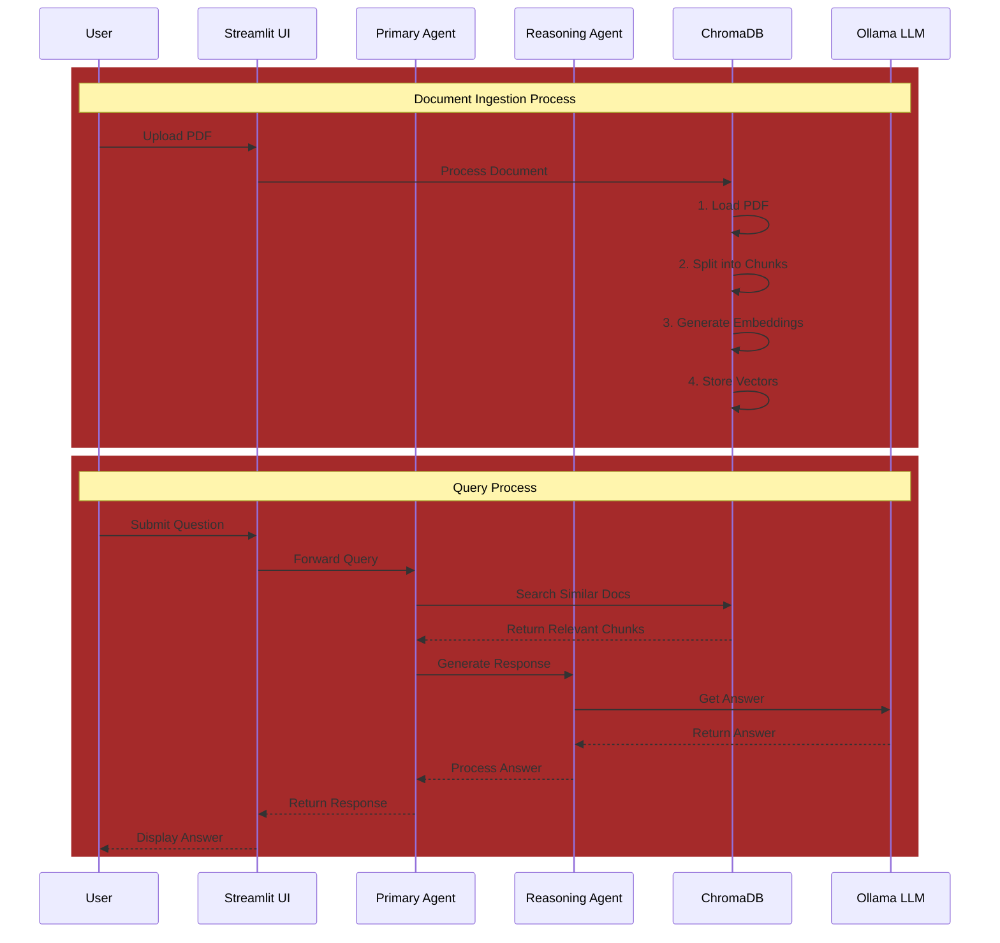

# RAG Application Architecture

## System Architecture


## Process Flow


## Component Details

### Frontend Layer
- **Streamlit UI**: Web-based user interface that provides:
  - Chat-style Q&A interface
  - Chat history management
  - Informative sidebar
  - Error handling and user feedback

### Processing Layer
- **PDF Processing**:
  - DirectoryLoader: Loads PDFs from specified directory
  - RecursiveCharacterTextSplitter: Splits documents into chunks (1000 chars, 200 overlap)

- **RAG Engine**:
  - Primary Agent: Orchestrates the RAG process
  - Reasoning Agent: Generates responses using context
  - Async processing with event loop management

- **AI Models**:
  - Ollama LLM: Local language model for response generation
  - HuggingFace Embeddings: sentence-transformers/all-mpnet-base-v2 for vector embeddings

### Storage Layer
- **ChromaDB**: Vector database storing:
  - Document chunks
  - Vector embeddings
  - Metadata
- **PDF Files**: Source documents in PDF format

### Key Features
1. **Asynchronous Processing**: Uses asyncio for non-blocking operations
2. **Error Handling**: Comprehensive error management and logging
3. **Modular Design**: Clear separation of concerns between components
4. **Scalable Architecture**: Components can be upgraded independently
5. **Local Processing**: Uses local LLM through Ollama for privacy and speed

### Data Flow
1. **Document Processing**:
   ```
   PDF → Text Chunks → Embeddings → Vector Store
   ```

2. **Query Processing**:
   ```
   Query → Vector Search → Context Retrieval → LLM Processing → Response
